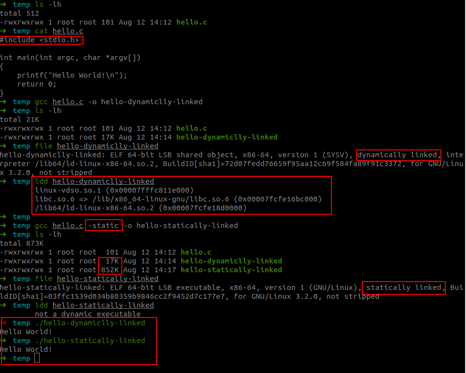

# Unix_Env_C_Programming

This is a repository for practising and analysing the examples talked in the book “Advanced Programming in the UNIX Environment” .

http://www.apuebook.com/

## Environment Setup

As we may know that for the compilation of a c source file, there are two ways of compiling and linking: statically or dynamically.

Unless indicated with `-static` flag, the `gcc` compiler will generate a executable file that rely on the `so`(shared libraries) on your system.  Below is a screenshot showing the differences between statically and dynamically linked hello word executable files:



A few things to note:

* the dynamically linked file is significantly smaller than the statically linked one.
* The output result is the same.
* The shared libraries is located in `/lib/x86_64-linux-gnu/libc.so.6` and `/lib64/ld-linux-x86-64.so.2`.

If we use `GDB` to dive deeper into the execution of these two binaries, we will know that:

In the hello word program, we referenced a header-file `stdio.h`, and then we use the standard-io function `printf`  to print strings to the console.

But we didn't implement the functionalities of `printf`. It turned out to be that there are some common libraries shared by c programs, and they are compiled into shared libraries(`libc`), so that we don't have to bother with some of the basic functionalities.

**Dynamically Linked Executables:**

When a program is dynamically linked, it uses shared libraries that are linked at runtime rather than at compile time. This means that the executable file does not contain the code for the libraries; instead, it contains references to these shared libraries. For example, a dynamically linked program might use `/lib/x86_64-linux-gnu/libc.so.6`. This library is loaded into memory when the program is run. You can inspect the assembly code or use tools like `ldd` to see which shared libraries are being used by the executable.

**Statically Linked Executables:**

In contrast, a statically linked executable contains all the necessary library code within the executable file itself. This means that all the code from the libraries is included in the final executable, resulting in a larger file. There is no need to load external shared libraries at runtime, which can simplify deployment but increases the size of the executable.

**What Next?**

Now that we know that when we compile the C program, we will always need the glic(GNU libc), either in shared libraries, or in object code format.

Given the purpose of this repository is to dive deeper in to the UNIX environment programming by writing C code, we better compile our own glibc from source code. Doing this will allow us to better understand the execution of the code and also make it easier for us to use GDB to debug.

### Download Glibc

https://www.gnu.org/software/libc/

https://mirror.csclub.uwaterloo.ca/gnu/glibc/

https://sourceware.org/glibc/manual/

### Compiling and Installation

```bash
# For ubuntu environment
sudo apt update
sudo apt install build-essential bison gawk
sudo apt build-dep glibc

wget http://ftp.gnu.org/gnu/libc/glibc-2.35.tar.gz

# substitute with your choice of glibc
tar -xvf glibc-2.35.tar.gz
cd glibc-2.35

# create a build path
mkdir build && cd build

# Configure the build environment
# Run the `configure` script to set up the build
# You might want to specify a seperate directory for installation to avoid your system's glibc!
../configure --prefix=path_to_your_installation

# compile (May take some time)
make -j8

# Optional but Recomanded
make check

# Install
make install
```

## Build with Your Custom Glibc

Since we now have the custom glibc of our own, we need to tell the compiler to link to it.

There are several posts can provide you with more details of how to do this:

https://stackoverflow.com/questions/10763394/how-to-build-a-c-program-using-a-custom-version-of-glibc-and-static-linking

https://sourceware.org/glibc/wiki/Tips_and_Tricks/How_to_Build_an_application_with_your_own_custom_glibc

Here I will provide you with a bash script that will allow you to automate this process:

```bash
#!/bin/bash
# change the "Target" and "GLIBCDIR" accordingly!
TARGET = target
OBJ = $(TARGET).o
SRC = $(TARGET).c
CC = gcc
CFLAGS = -g
LDFLAGS = -nostdlib -nostartfiles -static
GLIBCDIR = /path_to_your_install_of_glibc/glibc-2.39/lib
STARTFILES = $(GLIBCDIR)/crt1.o $(GLIBCDIR)/crti.o `gcc --print-file-name=crtbegin.o`
ENDFILES = `gcc --print-file-name=crtend.o` $(GLIBCDIR)/crtn.o
LIBGROUP = -Wl,--start-group $(GLIBCDIR)/libc.a -lgcc -lgcc_eh -Wl,--end-group

$(TARGET): $(OBJ)
	$(CC) $(LDFLAGS) -o $@ $(STARTFILES) $^ $(LIBGROUP) $(ENDFILES)

$(OBJ): $(SRC)
	$(CC) $(CFLAGS) -c $^

clean:
	rm -f *.o *.~ $(TARGET)

```


**Now, everything is setup, enjoy coding!**

# References:

1. https://stackoverflow.com/questions/10763394/how-to-build-a-c-program-using-a-custom-version-of-glibc-and-static-linking
2. https://sourceware.org/glibc/wiki/Tips_and_Tricks/How_to_Build_an_application_with_your_own_custom_glibc
3. https://www.gnu.org/software/libc/
4. https://mirror.csclub.uwaterloo.ca/gnu/glibc/
5. https://sourceware.org/glibc/manual/