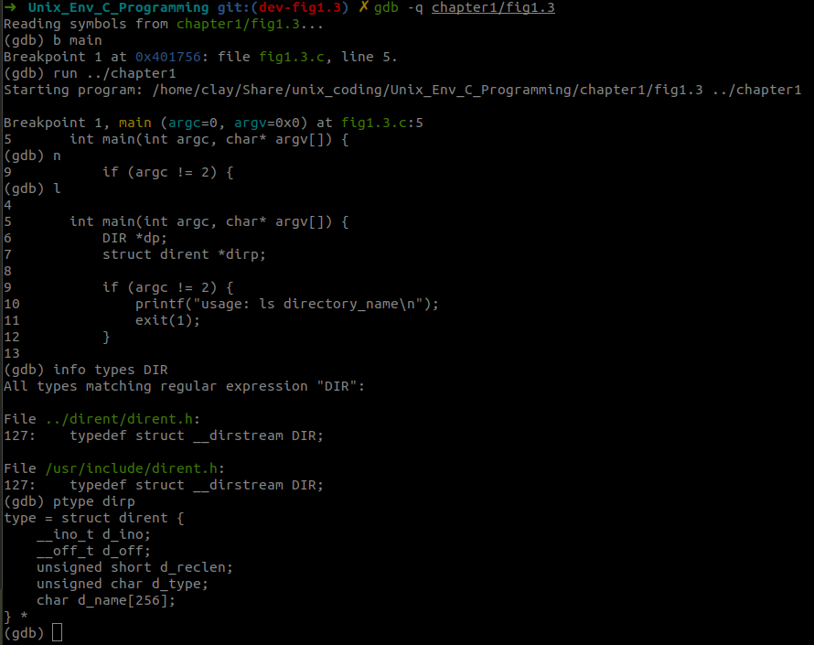

# `fig1.3`

In this program, we will write a simple program to list all the file names in a directory. This program bares similar functionality as the shell command `ls`, but it's simple and straight forward.

In order to further understand the code, we need to find the definition of a few data structures as well as functions:

Before we start, we can make some modification to make it easier:

```c
#include <dirent.h>
#include <stdio.h>
#include <stdlib.h>

int main(int argc, char* argv[]) {
    DIR *dp;
    struct dirent *dirp;

    if (argc != 2) {
        printf("usage: ls directory_name\n");
        exit(1);
    }

    if ((dp = opendir(argv[1])) == NULL) {
        printf("can't open %s\n", argv[1]);
    }
    while ((dirp = readdir(dp)) != NULL) {
        printf("%s\n", dirp->d_name);
    }

    closedir(dp);
    exit(0);
}
```

## Related Data Structures

**Note:**

You can type `info types DIR` in `gdb` to know where is the definition of this struct. Also, you may type `ptype dirp` to know the definition of the struct this pointer pointed to: 

### DIR

```c
// glibc-2.39/dirent/dirent.h
/* This is the data type of directory stream objects.
   The actual structure is opaque to users.  */
typedef struct __dirstream DIR;
```

```c
// glibc-2.39/sysdeps/unix/sysv/linux/dirstream.h
/* Directory stream type.

   The miscellaneous Unix `readdir' implementations read directory data
   into a buffer and return `struct dirent *' pointers into it.  */

struct __dirstream
  {
    int fd;			/* File descriptor.  */

    __libc_lock_define (, lock) /* Mutex lock for this structure.  */

    size_t allocation;		/* Space allocated for the block.  */
    size_t size;		/* Total valid data in the block.  */
    size_t offset;		/* Current offset into the block.  */

    off_t filepos;		/* Position of next entry to read.  */

    int errcode;		/* Delayed error code.  */

    /* Directory block.  We must make sure that this block starts
       at an address that is aligned adequately enough to store
       dirent entries.  Using the alignment of "void *" is not
       sufficient because dirents on 32-bit platforms can require
       64-bit alignment.  We use "long double" here to be consistent
       with what malloc uses.  */
    char data[0] __attribute__ ((aligned (__alignof__ (long double))));
  };
```

### dirent

```c
// glibc-2.39/sysdeps/unix/sysv/linux/bits/dirent.h
struct dirent
  {
#ifndef __USE_FILE_OFFSET64
    __ino_t d_ino;
    __off_t d_off;
#else
    __ino64_t d_ino;
    __off64_t d_off;
#endif
    unsigned short int d_reclen;
    unsigned char d_type;
    char d_name[256];		/* We must not include limits.h! */
  };
```

## Related Functions

### opendir

```c
// glibc-2.39/sysdeps/unix/sysv/linux/opendir.c +82
/* Open a directory stream on NAME.  */
DIR *
__opendir (const char *name)
{
  if (__glibc_unlikely (invalid_name (name)))
    return NULL;

  return opendir_tail (__open_nocancel (name, opendir_oflags));
}
weak_alias (__opendir, opendir)
```

```c
// glibc-2.39/sysdeps/unix/sysv/linux/opendir.c +44
static DIR *
opendir_tail (int fd)
{
  if (__glibc_unlikely (fd < 0))
    return NULL;

  /* Now make sure this really is a directory and nothing changed since the
     `stat' call.  The S_ISDIR check is superfluous if O_DIRECTORY works,
     but it's cheap and we need the stat call for st_blksize anyway.  */
  struct __stat64_t64 statbuf;
  if (__glibc_unlikely (__fstat64_time64 (fd, &statbuf) < 0))
    goto lose;
  if (__glibc_unlikely (! S_ISDIR (statbuf.st_mode)))
    {
      __set_errno (ENOTDIR);
    lose:
      __close_nocancel_nostatus (fd);
      return NULL;
    }

  return __alloc_dir (fd, true, 0, &statbuf);
}
```

### readdir

```c
/* Read a directory entry from DIRP.  */
struct dirent *
__readdir_unlocked (DIR *dirp)
{
  struct dirent *dp;
  int saved_errno = errno;

  if (dirp->offset >= dirp->size)
    {
      /* We've emptied out our buffer.  Refill it.  */

      size_t maxread = dirp->allocation;
      ssize_t bytes;

      bytes = __getdents (dirp->fd, dirp->data, maxread);
      if (bytes <= 0)
	{
	  /* Linux may fail with ENOENT on some file systems if the
	     directory inode is marked as dead (deleted).  POSIX
	     treats this as a regular end-of-directory condition, so
	     do not set errno in that case, to indicate success.  */
	  if (bytes == 0 || errno == ENOENT)
	    __set_errno (saved_errno);
	  return NULL;
	}
      dirp->size = (size_t) bytes;

      /* Reset the offset into the buffer.  */
      dirp->offset = 0;
    }

  dp = (struct dirent *) &dirp->data[dirp->offset];
  dirp->offset += dp->d_reclen;
  dirp->filepos = dp->d_off;

  return dp;
}
```

### closedir

```c
/* Close the directory stream DIRP.
   Return 0 if successful, -1 if not.  */
int
__closedir (DIR *dirp)
{
  int fd;

  if (dirp == NULL)
    {
      __set_errno (EINVAL);
      return -1;
    }

  /* We do not try to synchronize access here.  If some other thread
     still uses this handle it is a big mistake and that thread
     deserves all the bad data it gets.  */

  fd = dirp->fd;

#if IS_IN (libc)
  __libc_lock_fini (dirp->lock);
#endif

  free ((void *) dirp);

  return __close_nocancel (fd);
}
```

## Further Modification

In the previous example, we simply just print the error message to the standard io stream. In the following code, we will print error message to the error stream using c interface!

```c

```

# File System on Ubuntu

When you type command `df -T .`  on ubuntu terminal, you will see output similar to the following two screenshots.

In my computer, I have a segment of a SSD using NTFS file system, which is shared by two different systems -- windows and ubuntu. By doing this I can share my working spaces no matter which system I am running.

And for the NTFS file system, the Linux operating system provides a special file system --> FUSE file system. 


As for other part of the Ubuntu, it just use the EXT4 format.


We will dive deeper to these two types of file systems in the following two sections:

## FUSEBLK

## EXT4

**What is EXT? and what is EXT4?**

In 1992 the Extended File System or ext was launched specifically for the Linux operating system. It has its roots in the Minix Operating system. In 1993 an update called Extended File System 2 or ext2 was released and was the default file system in many [Linux distros](https://linuxiac.com/linux-distribution-types/) for many years.

By 2001 ext2 was upgraded to ext3, which introduced journaling to protect against corruption in crashes or power failures.

Ext4 (Fourth Extended Filesystem) was introduced in 2008, and it has been the default Linux filesystem since 2010. It was designed as a progressive revision of the ext3 file system and overcame some limitations in ext3.

As a result, ext4 has significant advantages over its predecessor, such as improved design, better performance, reliability, and new features.

Nowadays ext4 is the default file system on most Linux distributions. It can support large files and file systems of up to 16 terabytes.

**Ext4 Extents**:

The core of the Ext4 FS is the support for extents. An extent is simply a set of blocks which are logically contiguous within the file and also on the underlying block device. Most contemporary filesystems put considerable effort into allocating contiguous blocks for files as a way of making I/O operations faster, so blocks which are logically contiguous within the file often are also contiguous on-disk. As a result, storing the file structure as extents should result in significant compression of the file's metadata, since a single extent can replace a large number of block pointers. The reduction in metadata should enable faster access as well.

**On-Disk Structures:**

```c
/*
 * This is the extent on-disk structure.
 * It's used at the bottom of the tree.
 */
struct ext4_extent {
        __le32  ee_block;       /* first logical block extent covers */
        __le16  ee_len;         /* number of blocks covered by extent */
        __le16  ee_start_hi;    /* high 16 bits of physical block */
        __le32  ee_start_lo;    /* low 32 bits of physical block */
};

/*
 * This is index on-disk structure.
 * It's used at all the levels except the bottom.
 */
struct ext4_extent_idx {
        __le32  ei_block;       /* index covers logical blocks from 'block' */
        __le32  ei_leaf_lo;     /* pointer to the physical block of the next *
                                 * level. leaf or next index could be there */
        __le16  ei_leaf_hi;     /* high 16 bits of physical block */
        __u16   ei_unused;
};
```

**Disk Layout:**

https://ext4.wiki.kernel.org/index.php/Ext4_Disk_Layout

## FUSE

FUSE is a userspace filesystem framework. It consists of a kernel module (fuse.ko), a userspace library (libfuse.*) and a mount utility (fusermount).

One of the most important features of FUSE is allowing secure, non-privileged mounts. This opens up new possibilities for the use of filesystems. A good example is sshfs: a secure network filesystem using the sftp protocol.

The userspace library and utilities are available from the [FUSE homepage:](https://github.com/libfuse/)


**You can utilise the libfuse to compromise a ubuntu system, details in the following GitHub repository:**

https://github.com/dcheng69/CVE-2022-0185-Case-Study

# `GDB setup`

```bash
# set substitute-path to let gdb find glibc source code
# you can put this into a .gdbinit file

# set substitute path to look for source files
set substitute-path /home/clay/Share/unix_coding/ /home/clay/Share/unix_coding/glibc/src/

# you can use below command to check whether the source file path is correct
info sources
```

## `__glibc_unlikely`

The `__glibc_unlikely` function is a macro provided by the GNU C Library (glibc) that hints to the compiler about the likely outcome of a condition. It is typically used to optimize branch prediction.

# References

1. https://linuxiac.com/linux-file-system-types-explained-which-one-should-you-use/
1. https://opensource.com/article/17/5/introduction-ext4-filesystem
1. https://ext4.wiki.kernel.org/index.php/Main_Page
1. https://ext4.wiki.kernel.org/index.php/Ext4_Design
1. https://ext4.wiki.kernel.org/index.php/Ext4_Disk_Layout
1. https://en.wikipedia.org/wiki/Filesystem_in_Userspace
1. https://github.com/libfuse/
